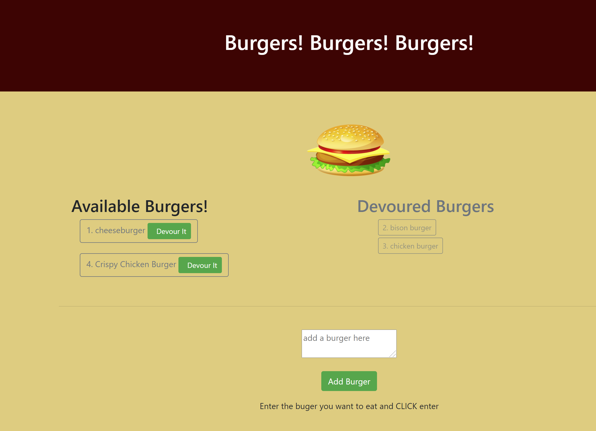

# Eat-Da-Burger 

* View the [Github Repo](https://github.com/girmaD/Eat-Da-Burger)
* View the [Deployed Heroku link](https://cryptic-refuge-14844.herokuapp.com/)

## Description
  This is a burger logger appilication built with MySQL, Node, Express, Handlebars and a homemade ORM (yum!). It follows the MVC design pattern; uses Node and MySQL to query and route data in the app, and Handlebars to generate your HTML.

## Table Of Contents 
* [Installation Instructions](#Installation-Instructions)
* [How To Use The App](#How-To-Use-The-App)
* [Contributing Guidelines](#Contributing-Guidelines)
* [Test Information](#Test-Information)
* [License](#License)
* [Questions](#Questions)

## Installation Instructions

 * fork and use it.
 * Don't forget to install all the modules this app depends on.
 * npm i -> will install all the dependecies

## How To Use The App
- Launch the app on the terminal - using (node server.js) or on heroku using the provided heroku link.
- Add as much burger you like - the added burgers will be displayed on the left side with **devoure it** button next to it
- You have the option to devour it. When you click **devour it** - the burger will be displayed on the right side
- Once devoured, there is no coming back!!!

Here is a screen shot of the page

## Contributing Guidelines
 * contact me on the email provided below

## Test Information
  * No test specified

## License

 * MIT

## Questions

Should you have any questions about this project,
  * you can reach me through email: [girma.derib@gmail.com](mailto:girma.derib@gmail.com) 
  * or visit my [Github Profile](https://github.com/girmaD) for more information.

